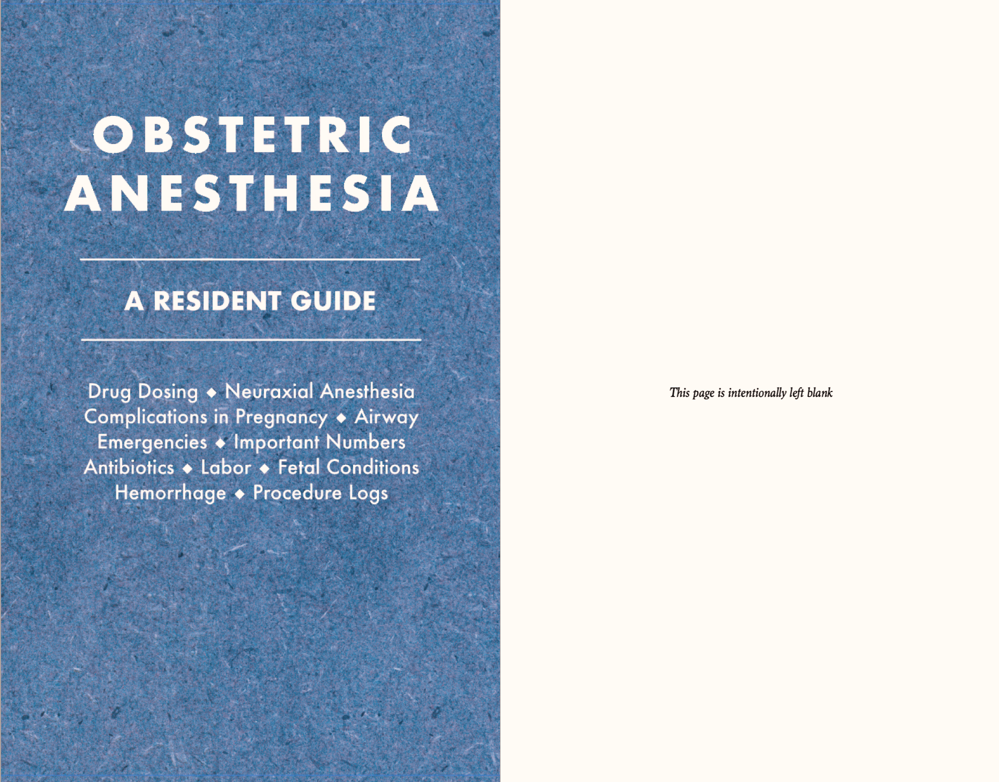
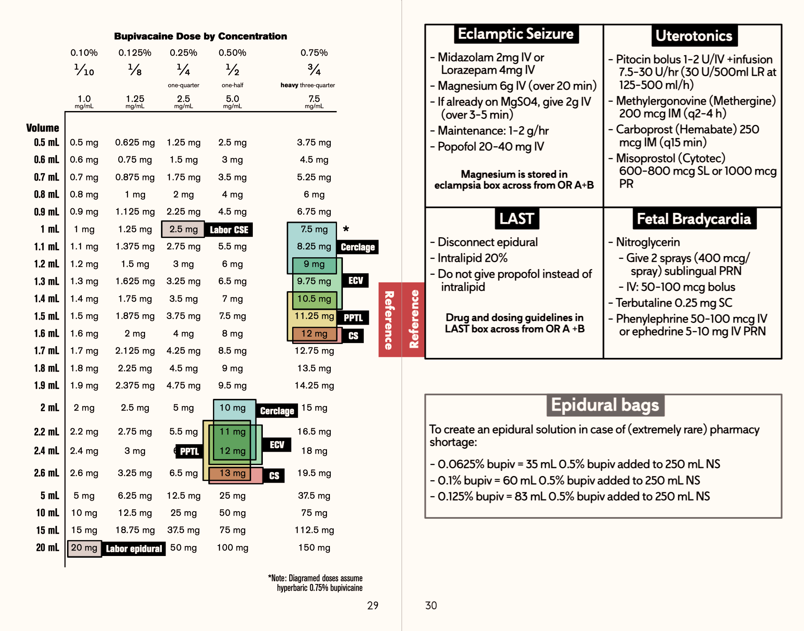

# ob-anesthesia-handbook
Obstetric Anesthesia: A Resident Guide. Written for anesthesia residents on Stanford Anesthesia OB Rotation.





# Build

To build/edit the manuscript, you will need LuaLaTex and Pandoc installed. I recommend installing Pandoc via python's PIP:

``` 
pip install pandoc
```

To build/edit the manuscript, clone the repo:

```
git clone https://github.com/alexgoodell/ob-anesthesia-handbook.git
cd ob-anesthesia-handbook.git
```

Make edits to main.md, which stores the bulk of the book. Then convert the book to PDF format with

```
make build
```

Which will produce output.text and output.pdf.